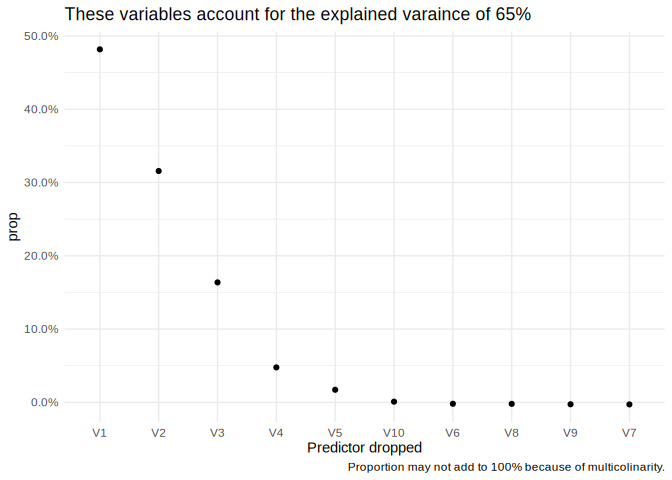

CV with stepwise regression
================
Aaron Peikert
7/1/2021

<!-- README.md is generated from README.Rmd. Please edit that file -->

``` r
if(!requireNamespace("pacman"))install.packages("pacman")
```

    ## Loading required namespace: pacman

``` r
pacman::p_load("here", "tidyverse", "caret", "skimr")
```

I will simulated a dataset. Replace `simulated` everywhere with whatever
you have. The data are simulated so that the first 5 variables are of
varying importance (ranging from .5 to .1) and the last five have no
predictive ability whatsoever.

``` r
n <- 500
true_beta <- c(0.5, 0.4, 0.3, 0.2, 0.1, rep(0, 5))
set.seed(1235)
normally_distributed <- matrix(rnorm(n*length(true_beta)), nrow = n)
simulated <- as.data.frame(normally_distributed)
simulated$y <- normally_distributed %*% true_beta + rnorm(n, sd = .5)
```

I’ll predict y from all other variables:

``` r
predictors <- names(select(simulated, -y))
predictors
```

    ##  [1] "V1"  "V2"  "V3"  "V4"  "V5"  "V6"  "V7"  "V8"  "V9"  "V10"

As discussed we drop one predictor at a time:

``` r
predictors_drop <- combn(predictors, length(predictors) - 1, simplify = FALSE)
not_in <- function(x, y)y[!(y %in% x)]
# name predictor sets after the variable that is not included
names(predictors_drop) <- map_chr(predictors_drop, ~not_in(.x, predictors))
# include one set with all predictors
predictors_drop$none <- predictors
# turn predictors into full formula
formulas <- map(predictors_drop, ~str_c("y ~ ", str_c(.x, collapse = " + ")))
```

We create 10 folds and repeat the process 10 times. It is important that
we deviate here a bit from the standard `caret` workflow. Usually you
call `trainControl` without index, which means for each training caret
creates a new random fold. However, this would introduce unnecessary
(random) variance, we would rather have the same cross validation set
across all models we compare. Therefore we create the folds beforehand
and set a seed so that it is always the same random draw.

``` r
nfolds <- 10
repeats <- 10
set.seed(1238)
cvindex <- caret::createMultiFolds(simulated$y, k = nfolds, times = repeats)
train.control <- trainControl(method = "repeatedcv", index = cvindex, allowParallel = TRUE, repeats = repeats)
#train.control <- trainControl(method = "cv", number = 10)
```

Let’s fit all models and cross-validate them.

``` r
models <- map(formulas, ~train(as.formula(.x), data = simulated,
                    method = "leapBackward",
                    tuneGrid = data.frame(nvmax = Inf),
                    trControl = train.control
                    ))
```

Extract results. Each row of results represents the average prediction
error over all 100 resamples (10 folds x 10 repeats) for one model where
one predictor is missing. We get several error measures like \(R^2\) and
there standard deviation (which we can use to create a confidence
interval).

``` r
results <- map_dfr(models, "results", .id = "predictor_dropped") %>%
  mutate(
    # add crude confidence interval
    Rsquared_lower = Rsquared - qnorm(0.05 / 2) * RsquaredSD,
    # alpha 5%
    Rsquared_upper = Rsquared + qnorm(0.05 / 2) * RsquaredSD,
    reference = predictor_dropped == "none"
  )
```

This plot shows the raw \(R^2\) for each model.

``` r
# reorder for sorting from high to low
ggplot(results, aes(reorder(predictor_dropped, Rsquared), Rsquared, color = reference)) +
  geom_point() +
  geom_errorbar(aes(ymin = Rsquared_lower, ymax = Rsquared_upper), width = .1) +
  theme_minimal() +
  theme(legend.position = "none") +
  scale_color_manual(values = c("TRUE" = "black", "FALSE" = "grey")) +
  xlab("Predictor dropped") +
  NULL
```

<!-- -->

This plots expresses the relative predictive power of each variable (50%
would mean that this variable, and only this variable, can explain 50%
of all the variance explained):

``` r
baseline <- filter(results, predictor_dropped == "none") %>% 
  pull(Rsquared)
results %>% filter(predictor_dropped != "none") %>% 
  mutate(prop = (baseline - Rsquared)/baseline) %>% 
  ggplot(aes(reorder(predictor_dropped, -prop), prop)) +
  geom_point() +
  theme_minimal() +
  scale_y_continuous(labels = scales::percent) +
  labs(title = paste0("These variables account for the explained varaince of ", round(baseline*100), "%"),
       caption = "Proportion may not add to 100% because of multicolinarity.",
       x = "Predictor dropped") +
  NULL
```

<!-- -->

In conclusion we can perfectly recover what we have simulated (V1 is
most important, V2 second most important etc. and V6-10 no importance).
